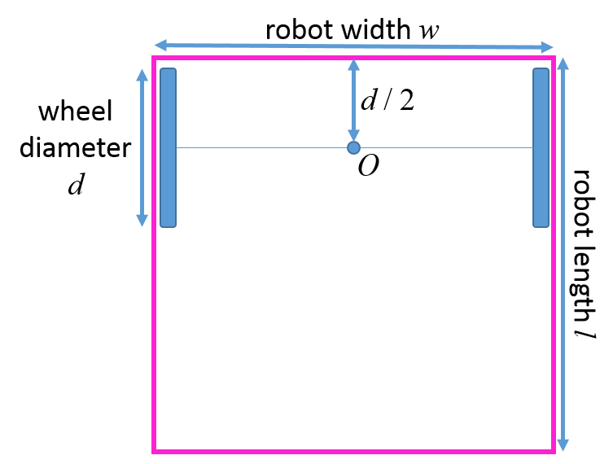

# Lab 1: Differential Drive Robot Kinematics Model

You in-pair formulate and implement a kinematics model for the Woodbot. You will use the
codes and fully implement skeleton codes in the main repository.

## Requirements and Submission
- [ ] The symbolic mathematical formulation of the given robot (both kinematics and sensor models)
in skeleton "your_model.md"
- [ ] The completed skeleton python module WoodbotModel.py implementing the above system models 
- [ ] Saved output from run_model.py (automatically generates all necessary outputs with a run)
- [ ] Complete the design decisions on sensor selections in "design_decision_sensors.md". 
- [ ] Submit a link to your forked repository with all above included

You will submit above requirements by commit and push all your changes to the remote repository. 
Please submit a link to your forked repository on Canvas.

List of files to modify
- your_math.md
- WoodbotModel.py
- design_decision_sensors.md

***
# A System Overview

Figure 1: Two wheeled differential drive robots with symbolic dimensions.

You will model two-wheeled robots similar to the Woodbot shown in Fig. 1. The robot has
two wheels of diameter d = 0.040m, separated by a distance w ≈ 0.1m. Each wheel is directly
driven from a continuous rotation servo. They drag a tail for stability, that contact the ground
at a distance l ≈ 0.090m behind their back edge. The position of each of these robots in the
environment is defined relative to their centerpoints O. Keep all dimensions symbolic as defined
here for the following sections.

We consider two laser range sensors and an IMU for extrinsic position sensing. The output of
these sensors will be a function of the positional state of the robot relative to its environment.

## Actuation Model
Each wheel is powered independently by a continuous rotation servo —part number FS90R— with
the angular velocity of the wheel controlled by a PWM signal from the microcontroller (-1.0 to
1.0). The control input to the robot hardware will be the PWM values you send to each wheel,
for a total of 2 input variables. This allows the robot to drive forwards or backwards at variable
speed, or turn with any turning radius.

## Sensor Model
Consider adding two laser range sensors —part number GYVL53L0X— and an inertial measure-
ment unit (IMU) —part ICM20948 IMU— onto your robot. The output of these sensors will be a
function of the state of the robot within its environment.

The laser range sensors are mounted on the robot such that they measure 1) the distance to a
wall in a straight line in front of the robot, and 2) the distance to a wall in a straight line to the
right of the robot. The IMU will return 1) a measurement of the in-plane rotational speed from
a angular rate (gyro) sensor, and 2) the components of the measured magnetic field along each of
the 2 in-plane coordinate axes, which can be used as a compass for absolute orientation relative to
Earth’s magnetic field. We will ignore the out-of-plane gyro and magnetometer axes, as well as the
accelerometer on the IMU. Thus this robot will produce 5 output values.

## Environment
Woodbot runs within a circular bound with a radius of $R_env=0.4m$.

## Mathematical Formulation
The state of your robot will satisfy the Markov property, capturing the complete history of actuator
inputs to the robot hardware, allowing for computation of the dynamics update as well as all of the
sensor measurements. Define this state, and then write out the analytic mathematical models for
the system dynamics and measurement processes, starting with an ideal theoretical model based
on fundamental principles.

Be sure to clearly define and describe all variables and equations, and produce illustrative
diagrams as necessary.

In the later lab sections we will consider uncertainty of the system.
3

