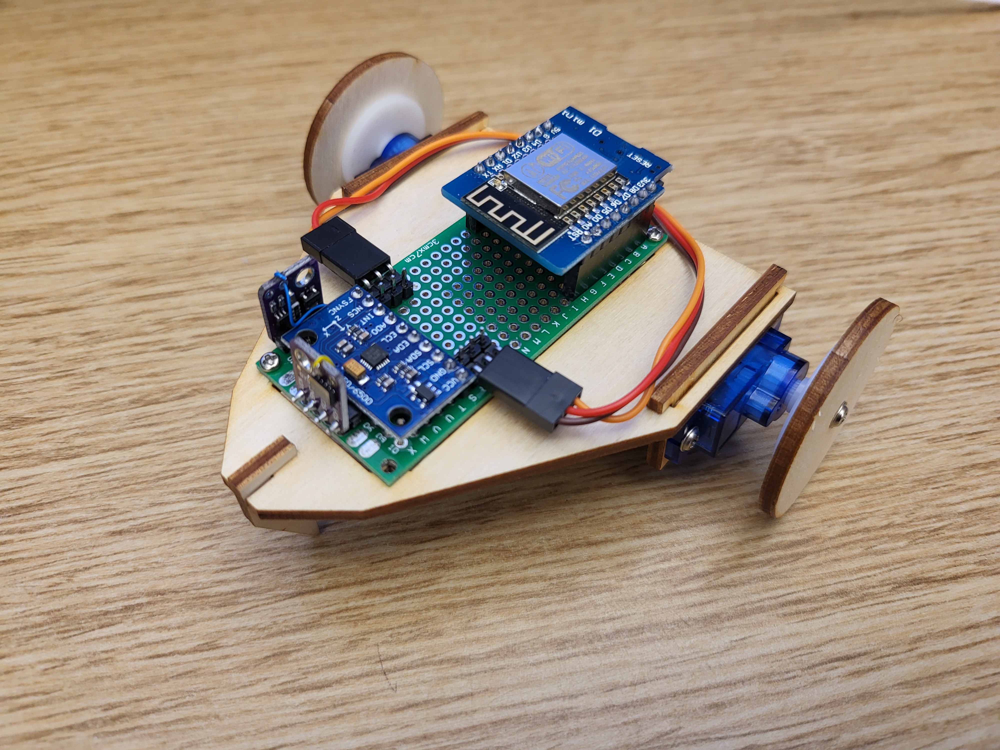
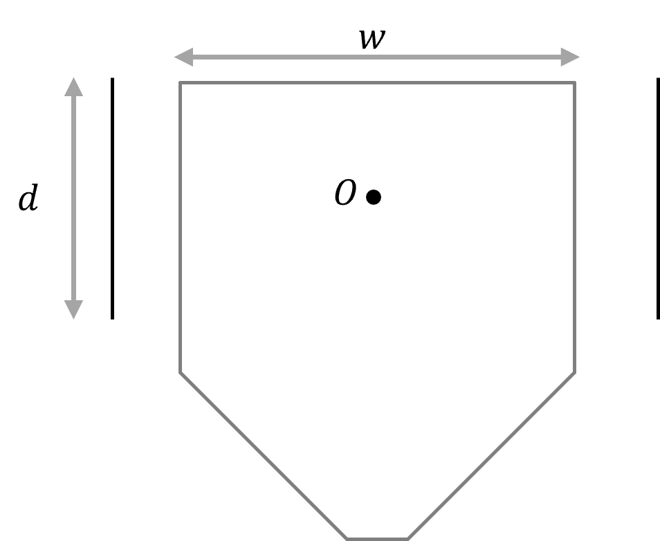
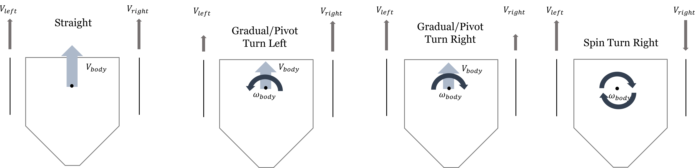
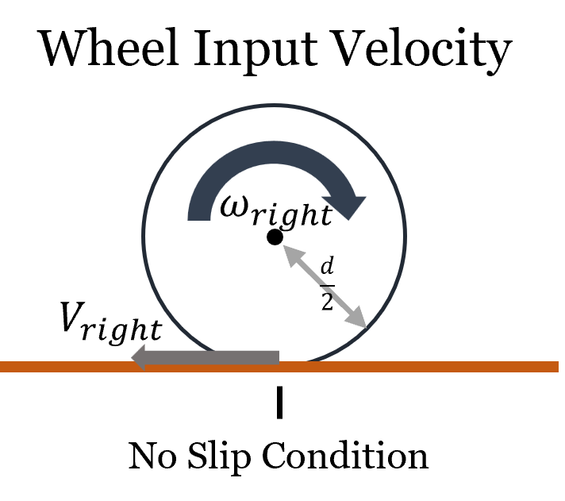
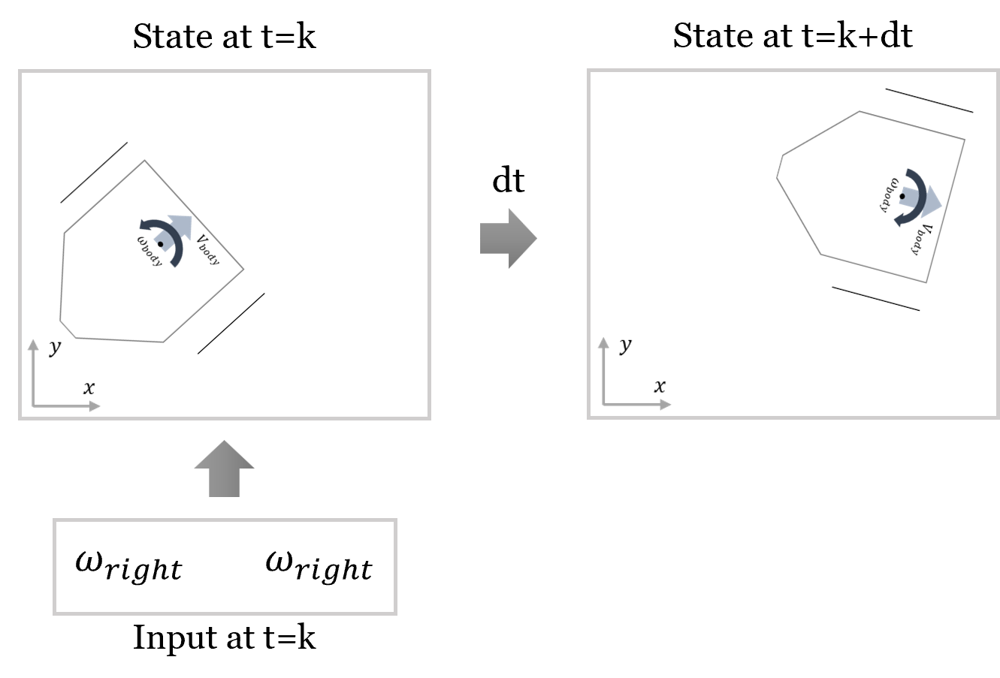
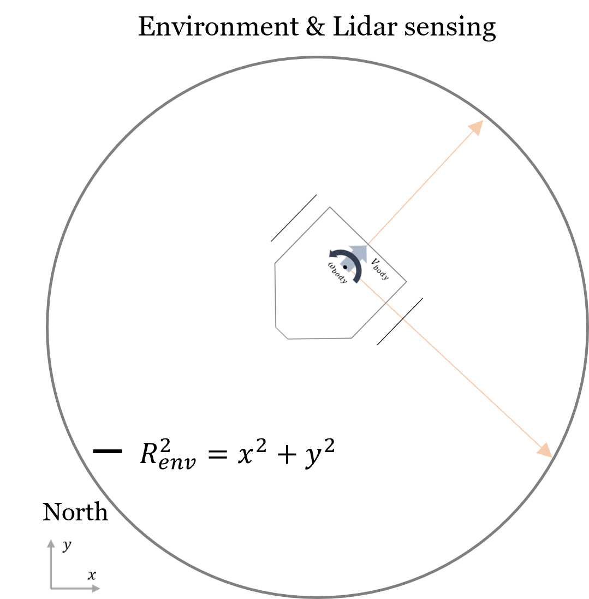
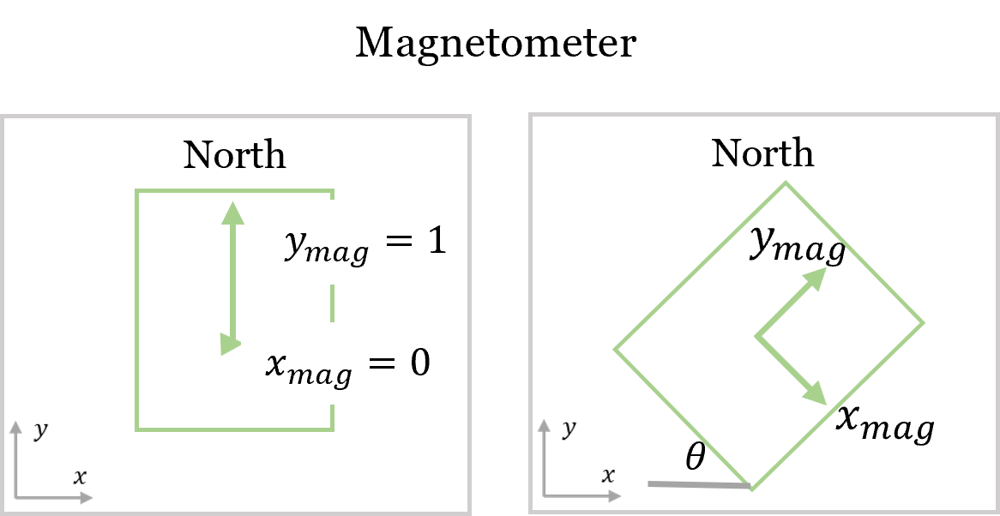

# Mathematical Model for Differential Drive Robot

## System Definition


Figure 1:Woodbot Hardware for this lab series.


In this lab, we formulates a mathematical model for Woodbot in Fig. 2, a differential drive 2-wheel robot. 


Figure 2: The Woodbot schematic and dimensions.


The robot physical dimensions are defined as in Fig. 2.

## Kinematics Model
### State

> Horizontal position $`x`$
>
> Vertical position $`y`$
>
> Robot's facing direction angle from x axis $`\theta`$ 

### Kinematics Model
The 4 patterns of differential drive robot forward and tun motions are illustrated as following.


The relationship between wheel angular velocity and wheel tangential velocity is illustrated as follows.


Thus, under no slip condition, the robot translational velocity and angular velocity can be described as:

> $`V_{body} = 0.5*(\frac{d}{2}*w_{left} + \frac{d}{2}*w_{right})`$
> 
> $`\Omega_{body} = \frac{1}{W} * (\frac{d}{2}*w_{right}-\frac{d}{2}*w_{left})`$
> 
> Note: for GitLab to show math you need to use 
```
$` latex math format `$ 
```
> You can use tool like [mathpix](https://mathpix.com/), which let you scan typed or hand written math into format
> 
> You can alternatively paste your math in images, such as:
``````

We can illustrate Markovian system the robot next state given the current state and input: 


Which now can be expressed in a 1st order system model (kinematics model) as:

> Your kinematics model here.
> 
> $`X' = {V_{body}}*cos(\theta_{body})\Delta t + X`$
>
> $`Y' = {V_{body}}*sin(\theta_{body})\Delta t + Y`$
>
> $`\theta' = {\omega_{body}}\Delta t + \theta`$
> 
> You can alternatively paste your math in images, such as:
``````


### Sensor Model


> Your lidar sensor model here.
> 
> $`x_{1}`$ and $`y_{1}`$ is current position
>
> $`y = mx+ b`$
> 
> $`m = tan(\theta)`$
>
> $`b = y_{1} - m*x_{1}`$
>
> $`y = tan(\theta) * x + y_{1} - m*x_{1} `$
>
> $`R^2 = x^2 + y^2`$
>
> $`R^2 = x^2 + (tan(\theta) * x + y_{1} - m*x_{1})^2`$
>
> $`x_{1} = -(\sqrt{R^2-x^2}-(tan(\theta) * x + y_{1}))/m `$
>
> $`y_{1} = \sqrt{R^2 -x^2} -tan(\theta) + m*x_{1} `$
>
> $`d = \sqrt{(x-x_{1}))^2 + ((y-y_{1}))^2}`$
> You can alternatively paste your math in images, such as:
``````



> $`y_{mag} = cos(\theta)`$
>
> $`x_{mag} = sin(\theta)`$
>
> $`\theta = arccos(y_{mag})`$ or $`arcsin(x_{mag})`$
> 
> You can alternatively paste your math in images, such as:
``````

